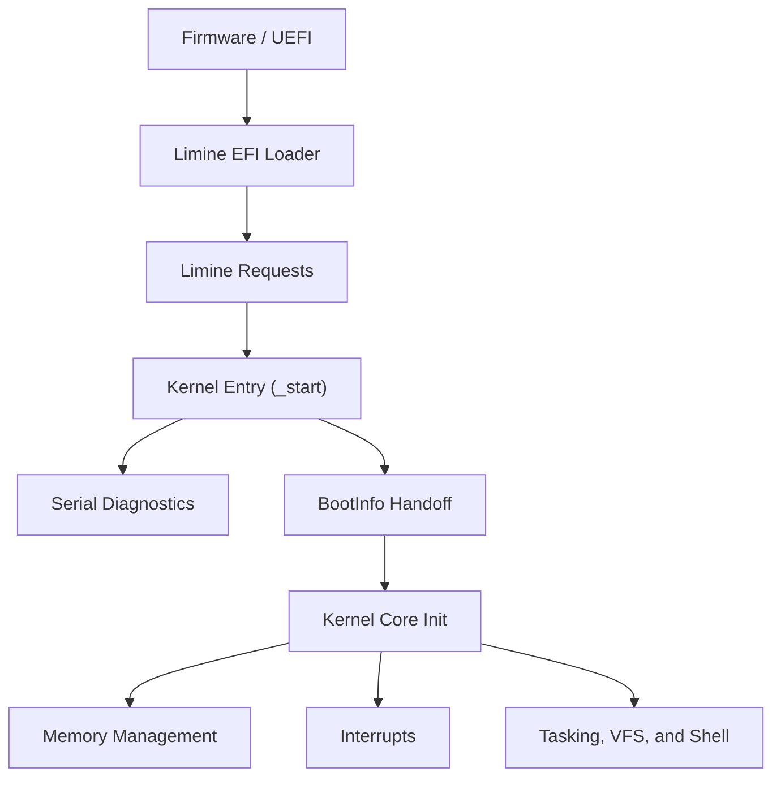

# AetherOS

[](https://github.com/JoaoVictorAAbreu-Dev/Projeto_AetherOS/actions)
[](https://github.com/JoaoVictorAAbreu-Dev/Projeto_AetherOS/actions)
[](LICENSE)
[](ROADMAP.md)
[](docs/architecture/overview.md)

AetherOS is an academic open source operating system for `x86_64`, built primarily in Rust and designed to run on QEMU.

The project has two equally important goals:

1. Build a clean, modular kernel with disciplined architecture.
2. Become a high-quality educational reference for students learning OSDev, low-level Rust, and computer architecture.

## Why AetherOS Exists

Many hobby operating system repositories either move too fast without explanation or stay at the level of a barebones boot screen. AetherOS is designed to sit in the middle:

- technically serious
- incremental
- well documented
- understandable by contributors who are still learning

This means architecture decisions, tradeoffs, roadmap choices, and subsystem boundaries are treated as first-class project artifacts.

## Current Status

The repository already includes:

- Cargo workspace organization
- initial architecture and development documentation
- Limine-based UEFI boot strategy
- real boot entry skeleton
- early serial-first diagnostics
- boot metadata handoff via `BootInfo`
- initial framebuffer-based visual boot stage
- initial in-kernel shell and in-memory initramfs/VFS path
- automated `xtask` flow for build, staging, test, and QEMU boot

Current implementation priority follows this fixed order:

1. Boot
2. VGA
3. Keyboard
4. Interrupts
5. Memory Management
6. Scheduler
7. Virtual File System
8. Shell
9. Process Management
10. Drivers

## Project Goals

- `x86_64` architecture
- Rust-first kernel
- Assembly only when strictly necessary
- QEMU-based development workflow
- modular, scalable source layout
- strong documentation and contributor experience
- educational value without sacrificing engineering quality

## Architecture Snapshot

- Boot protocol: `Limine`
- Primary architecture: `x86_64`
- Emulator: `QEMU`
- Language: `Rust`
- Repository model: Cargo workspace with isolated kernel, shared crates, tooling, and docs

### High-Level Flow



## Repository Layout

```text
AetherOS/
|-- boot/        # Boot protocol notes and boot assets
|-- config/      # Linker, target, QEMU, and boot configuration
|-- crates/      # Shared no_std support crates
|-- docs/        # Architecture, setup, tutorials, roadmap, and references
|-- kernel/      # Kernel source tree
|-- scripts/     # Local helper scripts
|-- tests/       # Integration and QEMU-oriented tests
|-- tools/       # Project tooling and future build helpers
`-- user/        # Future userland-facing artifacts
```

## Quick Start

### Prerequisites

- Rust nightly
- On Windows, prefer `nightly-x86_64-pc-windows-gnu`
- `rust-src`
- `llvm-tools-preview`
- QEMU with `edk2-x86_64` firmware
- Internet access on the first `xtask run` to download the Limine binary bundle

### Initial Validation

```bash
cargo run -p xtask -- test
cargo run -p xtask -- boot-check
```

### First Boot In QEMU

```bash
cargo run -p xtask -- run
```

Notes:

- The first `run` downloads the official Limine binary bundle into `dist/limine/`.
- The boot flow uses UEFI firmware plus a FAT-backed ESP directory, not `qemu -kernel`.
- On headless environments, set `AETHER_QEMU_DISPLAY=none`.
- To redirect serial logs, set `AETHER_QEMU_SERIAL=file:dist/serial.log`.
- `cargo run -p xtask -- boot-check` validates headless boot by waiting for the serial marker `AetherOS: kernel initialized`.

PowerShell helpers are available in [`scripts/`](scripts):

- `scripts/setup.ps1`
- `scripts/test.ps1`
- `scripts/run-qemu.ps1`

Windows note:

- The PowerShell scripts use `cargo +nightly-x86_64-pc-windows-gnu` to avoid requiring the MSVC linker.

### Where to Start Reading

- Architecture overview: [docs/architecture/overview.md](docs/architecture/overview.md)
- Boot flow: [docs/architecture/boot-flow.md](docs/architecture/boot-flow.md)
- Setup guide: [docs/development/setup.md](docs/development/setup.md)
- Contribution guide: [CONTRIBUTING.md](CONTRIBUTING.md)
- Roadmap: [ROADMAP.md](ROADMAP.md)

## Educational Value

AetherOS is intentionally structured to help readers answer questions like:

- How does a Rust kernel enter execution from a bootloader?
- How should `arch-specific` and `kernel-generic` code be separated?
- How do you evolve from bring-up to memory management without architecture drift?
- What documentation should exist in a serious OSDev project?
- How can a minimal shell and VFS be introduced before full process isolation?

## Demo Roadmap

To improve educational reach and GitHub appeal, the recommended showcase sequence is:

1. serial boot log capture GIF
2. framebuffer boot status GIF
3. keyboard input echo demo
4. interrupt tick visualization
5. shell walkthrough with `help`, `ls`, `cat`, `mem`, and `tasks`

A prepared plan for demos, GIFs, and release assets lives in [docs/showcase/demo-plan.md](docs/showcase/demo-plan.md).

## Documentation Map

- Architecture
  - [docs/architecture/overview.md](docs/architecture/overview.md)
  - [docs/architecture/boot-flow.md](docs/architecture/boot-flow.md)
  - [docs/architecture/memory.md](docs/architecture/memory.md)
  - [docs/architecture/interrupts.md](docs/architecture/interrupts.md)
  - [docs/architecture/scheduler.md](docs/architecture/scheduler.md)
  - [docs/architecture/syscall.md](docs/architecture/syscall.md)
- Development
  - [docs/development/setup.md](docs/development/setup.md)
  - [docs/development/build.md](docs/development/build.md)
  - [docs/development/debug.md](docs/development/debug.md)
  - [docs/development/testing.md](docs/development/testing.md)
- Tutorials
  - [docs/tutorials/first-contribution.md](docs/tutorials/first-contribution.md)
  - [docs/tutorials/boot-milestone.md](docs/tutorials/boot-milestone.md)
- Community and Growth
  - [docs/community/github-growth.md](docs/community/github-growth.md)
  - [docs/community/wiki-outline.md](docs/community/wiki-outline.md)
  - [docs/showcase/demo-plan.md](docs/showcase/demo-plan.md)
  - [docs/showcase/release-checklist.md](docs/showcase/release-checklist.md)

## Contributing

New contributors should start here:

1. Read [CONTRIBUTING.md](CONTRIBUTING.md)
2. Read [docs/tutorials/first-contribution.md](docs/tutorials/first-contribution.md)
3. Pick a scoped issue aligned with the current roadmap stage
4. Keep changes small and document architectural impact

## Releases

The project should use milestone-based educational releases instead of arbitrary version bumps. A release checklist is prepared in [docs/showcase/release-checklist.md](docs/showcase/release-checklist.md).

## v1 Baseline

Version `1.0.0` is defined as:

- booting through Limine on QEMU in an architecture-correct path
- reaching kernel bring-up with serial diagnostics
- exposing framebuffer status output when available
- accepting keyboard input into the in-kernel shell
- providing timer ticks, memory inspection, task inspection, and initramfs-backed file reads
- shipping reproducible build/test/run documentation for external testers

## Community Health

- Code of Conduct: [CODE_OF_CONDUCT.md](CODE_OF_CONDUCT.md)
- Contributing: [CONTRIBUTING.md](CONTRIBUTING.md)
- Changelog: [CHANGELOG.md](CHANGELOG.md)
- Security Policy: [SECURITY.md](SECURITY.md)
- Support Guide: [SUPPORT.md](SUPPORT.md)

## License

This project is licensed under the MIT License. See [LICENSE](LICENSE).
